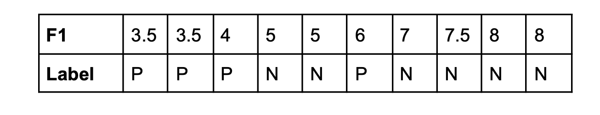

### Question 1
**a. Is the following statement true or false “A k-Nearest Neighbour classifier will always have perfect accuracy if the training data is used for testing”? Explain your answer. (5 marks)**

False. KNN classifcation steps are as follows:
1. Save all training data $x$ for later use
2. For each training data point $\hat{x}_i$ used for testing:
   2.1. Calculate the distance e.g. Euclidean for $\hat{x}_i$ and $x_i$
   2.2. Get labels for $k$ number of $x_i$ closest to $\hat{x}_i$
   2.3. Assign label for $\hat{x}_i$ based on majority voting

In step 2.2, there is a possibility that $\hat{x}_i$ is surrounded by more $x_i$s of the wrong label as long as $k \neq 1$. Therefore, based on step 2.3, the training data might still be misclassified.

**b. When decision tree pruning results in the removal of a sub-tree with the root of that sub-tree becoming a leaf node, what is the class label associated with this new leaf node? (5 marks)**

The instances of the classes in the original sub-tree is counted for each class. The class label will be that of the majority class. This decision retains the representativeness of the pruned sub-tree while simplifying the tree structure.

**c. The table below shows some data that is to be used for constructing a decision tree; the class labels are P and N and the values for feature F1 are numeric. What are the split points for F1 that need to be considered in calculating the Information Gain for this feature? That is, if F1 is being considered for a binary split what split points should be considered? (5 marks)**

Sorted unique values = [3.5, 4, 5, 6, 7, 7.5, 8]
Split points = midpoints between adjacent unique values = [3.75, 4.5, 5.5, 6.5, 7.25, 7.75]

**d. The Naive Bayes classifiers in scikit-learn have a fit_prior parameter that can be true or false. What are the two options for setting class priors that this parameter controls? (5 marks)**

1. When `fit_prior=True` it means the priors for each class will be learned from the data based on the frequency of the class.
2. When `fit_prior=False` it means that uniform priors will be used where each class is equally likely

**e. Why is it not possible to use k-means clustering with categorical data? (5 marks)**

K-means clustering is based on the minimisation of the sum of squared errors, which comes from the difference between the data points and their closest centroid.

The centroid is calculated based on the mean of the surrounding data points. Categorical data does not have a meaningful mean.

**f. Why is it important for Neural Networks to have cost (loss) functions that are differentiable? (5 marks)**

Neural networks requires derivatives to backpropagate and hence learn. Backpropagation algorithms like gradient descent uses the chain rule in differentiation to calculate gradients, which measure the effect of a small change in a parameter on the model outputs. Differentiating the cost function is the first step in the algorithm to obtain the error, and this error is backpropagated through the network via the chain rule. Therefore it is essential for cost functions to be differentiable.

**g. In wrapper-based feature selection, forward sequential search is inclined to be faster than backward elimination, why would that be? (5 marks)**

Forward sequential search explores the space incrementally by adding one feature at a time, which allows it to quickly identify relevant features and exiting when model performance plateaus. Backward elimination starts with the full set of features and removes them one by one. It might evaluate unnecessary feature combinations and is therefore much slower.

**h. In Machine Learning what is the difference between hyperparameters and other parameters? Give an example of each. (5 marks)**

Hyperparameters are settings outside of the model that cannot be learned from the data and set before training,  e.g. number of training epochs, learning rate.
Parameters refer to the variables in the machine learning model that can be learned from the data during the training process, e.g. weights and biases in a neural network.

### Question 2.
**a. If a distance measure is a proper metric it must meet the following four criteria:
i. d(x,x) = 0
ii. If x ≠ y then d(x,y) > 0
iii. d(x,y) = d(y,x)
iv. d(x,z) ≤ d(x,y) + d(y,z)
Based on these criteria, is Dynamic Time Warping a proper metric? Explain your answer. (10 marks)**

(i) DTW can violate this rule because the time series might be aligned to introduce negative values.
(ii) DTW can violate this rule because the distance between a time series and itself is not always 0 due to the variations introduced in the warping path.
(iii) DTW can violate this rule because the distance from A to B may be different from that of B to A
(iv) DTW can violate this rule for the triangle formed by the distance between time series.

**b. In developing k-Nearest Neighbour classifiers, what would be a consequence of using a distance measure that is not a metric? (8 marks)**

1. Identity of indiscernables violation: a metric ensures the distance of the same point is always 0.
2. Non-negativity violation: a metric ensures the distance between two points is should always non-negative.
3. Symmetric violation: a metric ensures the distance from A to B is always equal to that of B to A.
4. Triangle inequality violation: a metric ensures the sum of any two sides of a triangle should always be greater than or equal to the length of the remaining side.

With all four above violated, KNN will not be able to accurately classify data.

**c. Describe two methods for normalising data in Machine Learning. Why is data normalisation important when using a k-Nearest Neighbour classifier? (12 marks)**

1. Min-max normalisation: find the minimum and maximum values in each feature column then normalise all data points: $X_{norm} = \frac{X - X_{min}}{X_{max} - X_{min}}$
2. Standardisation: transform all data to follow a normal distribution: $X_{stan} = \frac{X - \mu}{\sigma}$ where $\mu$ = mean and $\sigma$ = standard deviation.

KNN algorithm is as follows:
1. Save all datapoints $\boldsymbol{x}$ for classification use (lazy classifier)
2. Define $k$ number of neighbouts
3. For each input data $\hat{x}_i$:
   1. Calculate the distance of $\hat{x}_i$ with each $x_i$, e.g. Euclidean metric
   2. Select $k$ closest neighbours to $\hat{x_i}$
   3. Assign label to $\hat{x_i}$ by performing e.g. majority voting

If the training data has a large numerical range e.g. 0.1 to 1000, features with larger numerical values will contribute more to the distance calculated in step 2.1. The algorithm will be biased towards larger features, i.e. giving larger features more importance in determining the nearest neighbours.

### Question 3.
**a. What is the role for Confusion Matrices in the evaluation of Machine Learning Classifiers? What insights might be offered from examining a Confusion Matrix that might not come from considering the Misclassification Rate only? (10 marks)**

Misclassification rate is just 1 - accuracy. If we had an imbalanced dataset, the mode could easily get low misclassification rates by simply predicting the majority class every time. This is not ideal as we want the model to actually make a classification decision.

Using a confusion matrix shows us several data: true positives (TP), true negatives (TN), false positives (FP) and false negatives (FN). We can also infer total predicted positives (TP + FP) and total predicted negatives (TN + FN) from the matrix.

From the confusion matrix we can also compute metrics such as $precision = \frac{TP}{TP + FP}$ and $recall = \frac{TP}{TP + FN}$.

The problem of constantly predicting majority (negative) class can be identified by looking at the recall. A low recall means the model is not good at identifying our minority (positive) class.

Other than that, precision can tell us how trustworthy or reliable is the model when it classifies something as positive. A high precision means that we can be confident that the classified positives are truly positive.

**b. What is the difference between hold-out testing and cross validation? When compared with hold-out testing, cross-validation testing can provide estimates of generalisation accuracy that are:
i. more accurate
ii. more stable
Explain both of these claims. (12 marks)**

Hold-out testing is where the dataset is randomly split into a training and testing dataset (sometimes even has an extra validation dataset) according to a ratio, e.g. 70:30. The model is trained using only the training data and evaluated using the testing data.

Cross-validation testing is where the dataset is split into $k$ random disjoint subsets named as folds. For each of $k$ runs, select one of the folds for testing and the rest $k - 1$ folds for training. The evaluated metric is averaged across $k$ runs.

(i) Cross-validation testing is more accurate because it tests the model with all parts of the data. Hold-out testing can over- or under-estimate the model performance depending on the content of the training and testing set.
(ii) Cross-validation testing takes the the average of the metric over $k$ runs. Even when the data is split with different random seeds and the entire CV process is rerun several times, the resulting metric should be close in value, i.e. more stable.  Metric for hold-out testing can change considerably when the data is split with different random seeds.

**c. In what circumstances would cross-validation have no advantages over hold-out testing? (8 marks)**

1. Large dataset - if the dataset is extremely large, hold-out testing may be sufficient because the test set size would be large enough to be representative of the entire dataset.
2. Time-dependent data - without randomly shuffling the dataset, hold-out testing may make more sense in terms of a forecasting problem by using the most recent data as test set. Cross-validation testing would not make as much sense.
3. Model stability: if the model is insensitive to variations in data, cross-validation testing has no advantage over hold-out testing.
4. Training time: if the model and dataset are large, taking a long time to train on cross-validation testing, hold-out testing will be preferred for a quick evaluation.

### Question 4.
**a. Explain why diversity is important in Machine Learning ensembles for classification and regression. (10 marks)**

1. Prevent same errors - different models have their respective strengths. Their errors and strengths might cancel out in an ensemble.
2. Generalisabilty - different models can capture different aspects of the dataset, improving generalisability overall.
3. Prevent overfitting - combining models that overfit to different subsets of data can help mitigate overfitting.
4. Better exporation of solution space - different models with varying hyperparameters and configurations can encourage a better exploration of the solution space to the problem.
5. Less sensitive to data distribution - since each model has a its bias towards a particular data distribution, combinining them averages out these biases and makes the ensemble more robust to different types of data distribution.
6. More confidence in prediction - when the models all agree on a prediction, it gives the ensemble more confidenc in that prediction. When they disagree, the ensemble can be more cautious.
7. Stability - a diverse ensemble is less likely to be affected by outliers that might throw some individual models off.

**b. Bagging (bootstrap aggregation) has a mechanism for achieving diversity; explain how it works. (7 marks)**

Bagging involves random sampling with replacement from a dataset. There is a possibilty where some examples are repeated and some excluded. Randomness and diversity are achieved at this step.

An instance of the same model will be trained on each subsample, e.g. a decision tree for each subsample. Each model will capture different aspects of the data because it was trained on a variation of the data. Training for each model can be parallelised because they are independent.

The model predictions are then all aggregated to make a final prediction, either by voting (for classification tasks) or averaging (for regression tasks).

**c. Bootstrap resampling will not produce diversity in ensembles of nearest-neighbour classifiers; describe a process that will. (6 marks)**

Bootstrap sampling does not work with KNN ensembles because KNN is not sensitive to data variation, especially with small $k$ values. Random subspacing will work because it randomly chooses a subset of features without replacement for $n$ times. Each KNN classifier is trained on a different subset of features.

Predictions from each KNn instance will be gathered for a final prediction. Simple majority voting can be used where the class with the majority vote wins. Alternatively, weighted voting can be used, where each KNN's vote is weighted by its classification accuracy. More accurate classifier contributes more to the ensemble

**d. Explain what differentiates the different ensemble members in a Boosting Ensemble. (7 marks)**

The variation between ensemble members in boosting algorithms comes from the process below:
1. Sampling - the dataset is randomly sampled with replacement based on equal weights
2. Weight update - after classifier is trained and evaluated on this subsample, the weights of the misclassified examples are increased and correct examples decreased.
3. Retrain - the classifier is retrained on the subsample with updated weights
4. Repeat - step 2 - 3 until stop condition

Each ensemble member therefore has a different subset of training dataset with different weights.