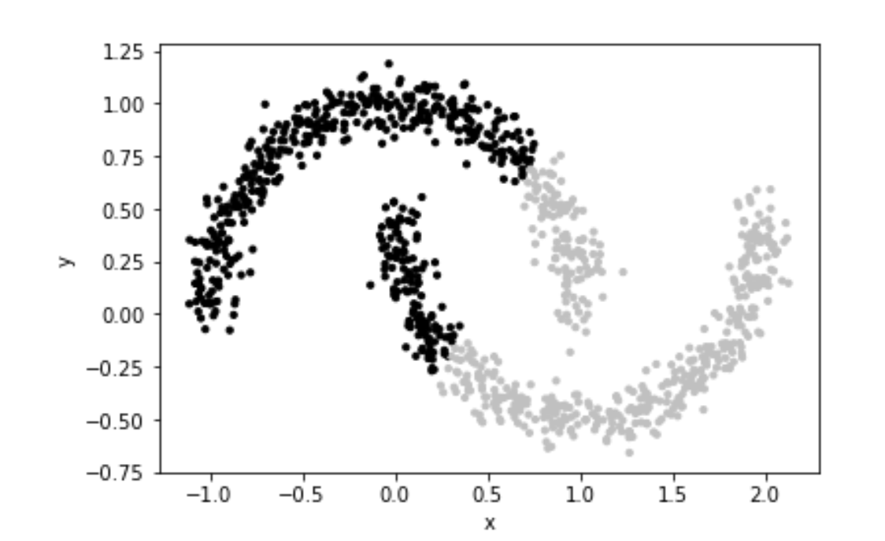

### Question 1

**a) In k-Nearest Neighbour retrieval how can distances be calculated for Ordinal features? (5 marks)**

Ordinal data is categorical data with a meaningful order, e.g. levels of spiciness (low, medium, high). To calculate the distance for the KNN algorithm, the data labels must be first encoded into numbers. Then take the Manhattan (L1) distance, which is the absolute difference, for the two levels.

**b) With scikit-learn, when StandardScalar normalisation (also known as N(0,1) normalisation) is applied to data, what is the distribution of the data after normalisation? (5 marks)**

$X_{transformed} = \frac{X - \mu}{\sigma}$
Where $X$ is a vector of data.

Each $x_i$ is centred around the mean and its distance from the mean is normalised by the standard deviation. Therefore, the post-transform data follows the standard normal distribution with mean of 0 and standard deviation of 1.

**c) If you have a collection of 3 green and 4 red balls and you add 2 green balls to the collection what happens to the entropy of the collection? (5 marks)**

$E = \sum_{i=1}^n -p_i log_2(p_i)$
Where $p_i$ is the probability of classes.

Before addition:
$TotalBalls = 3 + 4 = 7$
$E_0 = -\frac{3}{7} \log_2(\frac{3}{7}) - \frac{4}{7} \log_2(\frac{4}{7}) = 0.985$

After addition:
$TotalBalls = 3 + 2 + 5 = 9$
$E_1 = \frac{5}{9} \log_2(\frac{5}{9}) + \frac{4}{9} \log_2(\frac{4}{9}) = 0.991$

The entropy increases because there is more impurity.

[Moritz] It will increase, because a 5/9 to 4/9 split is closer to a 50/50 (maximum entropy) than a 3/7 to 4/7 split.

**d. If we have two decision trees, one simple and one more complex that both perfectly explain the training data, which should we prefer? Briefly explain why. (5 marks)**

We should use the simpler tree because of Occam's Razor principle. We always choose the simplest theory that can best explain the data.

1. Avoids overfitting: the complex tree can risk capturing noise in the data instead of the true patterns.
2. Interpretability: the simpler tree is easier to interpret and understand, which is beneficial when trying to debug the model.

**e. When scoring the performance of classifiers what is the motivation for using balanced measures such as Balanced Accuracy Rate or Balanced Error Rate? (5 marks)**

$BalancedAccuracyRate = \frac{TruePositiveRate + TrueNegativeRate}{2}$;
$TruePositiveRate = sensitivity = \frac{TruePositives}{TruePositives + FalseNegatives} = recall$
$TrueNegativeRate = specificity = \frac{TrueNegatives}{TrueNegatives + FalsePositives}$

$BalancedErrorRate = \frac{FalsePositiveRate + FalseNegativeRate}{2}$
$FalsePositiveRate = 1 - TrueNegativeRate$
$FalseNegativeRate = 1 - TruePositiveRate$

The balanced accuracy and balanced error rate are a more accurate representation of the classifiers' performance especially when data classes are highly imbalanced. If only accuracy is used, the classifiers can simply predict the majority class all the time to get a high accuracy score.

**f. Name two options for dealing with numeric (real valued) features in a Naive Bayes classifier. (5 marks)**

1. Discretisation - turn continuous features into discrete classes by either binning or splitting into intervals, followed by assigning labels to each bin/interval.
2. Use PMF or PDF - instead of using naive bayes to estimate the prior and likelihood probabilities directly, use it to estimate the parameters of a certain probability density function (PDF), e.g. estimate the mean and variance of a normal distribution. The PDF will be used in classification to take in continuous input and outputs the corresponding probability.

**g. Why is it not possible to use k-Means clustering with categorical data. (5 marks)**

K-means is based on the concept of minimising the distances between data points and their nearest centroid, which is known as sum of squared error.

1. No meaningful distance - categorical items do not have a meaningful distance, i.e. distance between "red" and "blue".
2. No meaningful mean - by extension, categorical items do not have a meaningful mean.

**h. Briefly describe one method to achieve diversity in an ensemble. (5 marks)**

Bootstrap aggregation is one of the methods, commonly used in the random forest algorithm. It first uses random sampling with replacement to produce several subsamples of data. A model instance is created to train on each subsample. Some examples might be duplicated and others left out.

### Question 2
**a. Explain why training a multi-layer feedforward neural network is considerably more difficult than training a single layer network. (8 marks)**

1. Vanishing or exploding gradients - if the network has too many layers, differentiation will have to be performed for each layer, meaining that each gradient must be multiplied. This can either lead to vanishing gradients, where the gradient eventually gets too small to update earlier layers; or exploding gradients, where the gradient becomes bigger with each layer that it fails to converge to 0.
2. Training time - the time taken to train a multi-layer neural network can be much longer than a single-layer network for the same amount of data due to more trainable hyperparameters.
3. Initialisation challenges - initial weights can substantially affect the performance of a deep neural network.
4. Overfitting - because multi-layer neural networks have muc more parameters than a single layer network, they are prone to overfitting especially when the size of dataset is limited.

**b. Even in a simple single layer Feedforward Neural Network the units (neurons) will have a fixed bias input. What is the reason for this bias input? (7 marks)**

The bias input is equivalent to a y-intercept.

1. Better performance - some datasets are not centred around zero, which means their y-intercept does not pass through the origin. Adding the bias term will help the network to not only learn te shape of the data but also the exact location of the data.
2. increasing activation threshold - the bias input makes it harder for the neuron to activate due to a certain threshold.

**c. Explain the operation of the following components in the training of a neural network using gradient descent;
i. Cost function
ii. Weight update
iii. Stopping condition
(10 marks)**

Gradient descent in general follows these few steps:
1. Choose initial weights and biases (mostly between -0.5 and 0.5)
2. Set all gradients to 0
3. For each training example:
   1. Calculate cost function
   2. Calculate gradients for each parameter (weight or bias)
   3. Update parameter gradients
4. Update parameter values using the weight update rule
5. Repeat steps 1 - 4 until stopping condiiton is hit

(i) Cost function is the formula to measure how different the model's outputs is from the expected answers. An example of this is the Mean Squared Error (MSE), $C(w, b) = \frac{1}{n}\sum_{i=1}^n (y_i - \hat{y}_i)^2$ where $w$ is the weights, $b$ is the biases, $y$ is the expected answers and $\hat{y}$ is the model's predicted outputs.

Another example is the cross entropy function $C(w, b) = -\frac{1}{n} \sum_{i=1}^n [y_i log(p_i) + (1-y_i) log_ (1 - p_i)]$ where $p$ is the predicted probability from the model. The choice of cost function depends on the problem. A regression problem would, e.g., use MSE and a classification problem would, e.g., use cross entropy.

(ii) Weight update follows this formula $w_{t+1} = w_t + \alpha \centerdot \frac{\partial C}{\partial w_t}$ where $t$ is the iteration, $\alpha$ is the learning rate and  $\frac{\partial C}{\partial w_t}$ is the partial derivative for $w_t$. This equation is generic and only for one parameter. This process will be repeated for all parameters (weights and biases) for each iteration.

(iii) Stopping condition is a criteria used to terminate the gradient descent loop. It can either be the number of iterations, the maximum training time, the minimum loss calculated from the cost function, etc.

**d. What is the difference between stochastic gradient descent and batch gradient descent? (5 marks)**

1. Gradient update - SGD updates parameters based on a randomly selected training example per iteration. Batch GD updates parameters based on all training examples per iteration.
2. Nature of algorithm - SGD is probabillistic as it has a random component when selecting the random training example, meaning that even with the same initial weights, SGD will not necessarily result in the same output with different training runs. Batch GD is deterministic, meaning that the outputs will be the same as long as the initial weights are the same.

### Question 3
**a. When grid search is being used as part of a model selection process, explain the difference between random and exhaustive grid search. Mention one advantage of each strategy. (8 marks)**

In grid search, all possible combinations are evaluated, but only a random subset of possible combinations are evaluated for random grid search.

Grid search systematically evaluates all possible combinations for the absolute optimal performance. It will not miss out any possibilities.

Random grid search is much more efficient with good-enough performance. The final selected combination might not be the most efficient, but it will be good enough.

**b. Explain the difference between hyperparameters and ordinary model parameters using neural networks as an example. (7 marks)**

Hyperparameters are external settings that are not learnable from the data, i.e. preset before the training commences. Number of training iterations, learning rate, e.g. are hyperparameters for the neural network.

Ordinary model parameters are variables that are trainable from the data, i.e. updated throughout the training backpropagation process. Weights and biases in neural network are parameters that are learned from the underlying patterns in the data.

**c. An important principle in evaluating machine learning models is that the test data should not be accessed in the model training process because it can result in unrealistic estimates of generalisation accuracy. This applies to the data preprocessing pipeline as well as the model fitting itself. In practice some scenarios are more serious than others; comment on the seriousness of each of the following scenarios:
i. The training data is used during the feature selection process.
ii. The training data is used to fit a One-Hot Encoder.
iii. Missing values are replaced using the mean values for features across the training and test sets, i.e. the test data is used when the means are being calculated.
(15 marks)**

(i) Not serious. Features selected are based on training set and might risk overfitting, but there will be no data leakage from the testing set.

Assuming it is a typo (training data meant training and testing data): seriousness is high. Specific characteristics of the test data might be factored into consideration during teature selection, resulting in an overly-optimistic model performance.

(ii) No effect

(iii) Seriousness is moderate to high. The mean of the testing set would influence the imputation value, but if the testing and training data are large enough both means would be very close, so it is not as serious.

### Question 4
**a. Sample data from the synthetic half-moons dataset from scikit-learn is shown in the plot below. This is a tabular dataset with each point represented by two features, the x and y coordinates. The clusters found by k-Means clustering are shown (black and grey), k-Means has not been effective for finding clusters in this dataset, why is that? (10 marks)**

K-means work on the assumption where data clusters are spherical and data points are close to its centroid.

This is how K-means work:
1. Define the desired number of clusters
2. Initialise the x, y position of the centroid for each cluster randomly
3. Assign each data point to its nearest centroid using a distance measure such as Euclidean distance
4. Compute the mean for each cluster, which will be the new centroid
5. Repeat steps 2 - 4 until no reassignments occur

The concept of using the distance measuring in step 2 is an assumption that all data points will be close to its centroid, but in the half-moon dataset, data points can be far away from its centroid. Using the mean as the centroid assumes that the data shape will be spherical, but the data shape in the half-moon dataset is elongated and curved.

**b. In contrast, spectral clustering is able to uncover the correct clusters in this data.
i. Explain in outline how spectral clustering can be applied to tabular data.
ii. Explain why spectral clustering would work well on this data.
(10 marks)**

(i)
1. Convert the tabular data into a matrix named $X$.
2. Create an similarity graph by using e.g. Euclidean distance
3. Create an affinity matrix that represents the relationship between nodes
4. Calculate the degree matrix that denotes the number of edges from the node
5. Calculate the Laplacian matrix using $L = D - S$ where $L$ is the Laplacian matrix, $D$ is the degree matrix and $S$ is the affinity matrix
6. Perform eigendecomposiiton on the Laplacian matrix
7. Since the intended number of partitions is 2, take the eigenvectors corresponding to the 2 smallest eigenvalues
8. Discard the eigenvactor with the smallest eigenvalue
9. The Fiedler vector which is the eigenvector corresponding to the second smallest eigenvalue is the partition for the dataset

(ii) Spectral clustering does not assume a shape or distribution of the clusters. Its only goal is to minimise the number of cut connections when separating the data. For data points within the half-moon cluster, there will be a lot of connections within that area. Since the half-moon clusters are at a distance from each other, the number of connections between clusters would be much lesser. This enables the spectral clustering algorithm to identify the correct paritioning.

**c. The half-moons data has a simple feature vector format where the features are the x and y coordinates. Explain how this could be converted into the affinity matrix format required for spectral clustering. (10 marks)**

1. Calculate pairwise distance between all data points using e.g. Euclidean distance
2. Create the affinity matrix where it is a square symmetric matrix where $A_{ij}$ represent the strength (or existence) of relationships between data $i$ and $j$, where $A_{ij} = similarity(x_i, x_j)$
3. KNN can be used as its similarity function. Each data point will be connected to its $k$ nearest neighbours.